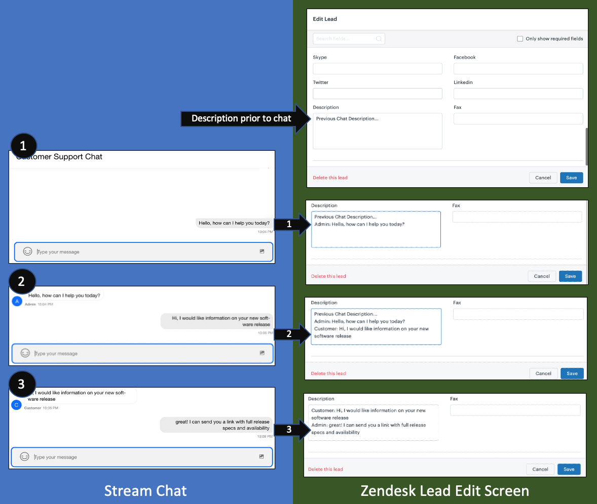
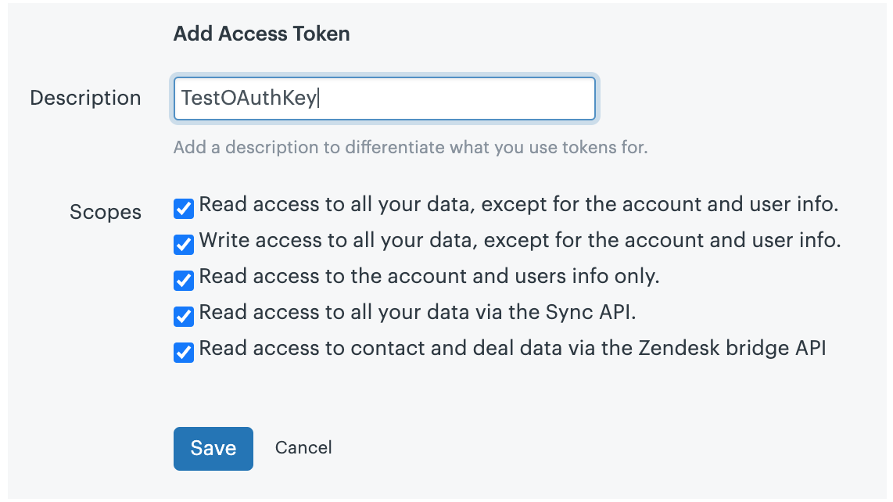
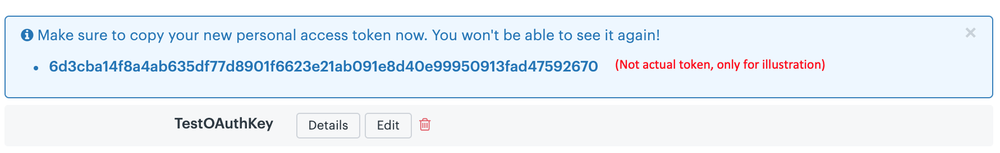

# Real-time capture of a chat transcript with Stream Chat

Would real-time chat transcript handling improve your chat widget? Would your chat applications be improved with more timely handling of customer chat inquiries? This post demonstrates how to leverage the powerful [Stream Chat API](https://getstream.io/chat/docs) to take action with a chat transcript in real time. The techniques provided here will help you better understand key components of the Stream Chat and Zendesk APIs, so you can leverage them for similar applications.

This post explains how to update a Zendesk CRM Lead in real-time with the transcript messages of a `Customer` and a `Sales Admin` during a `Chat-based Sales Inquiry`.

The simplified process of this post assumes that a customer has already initiated a chat inquiry with customer support, so it provides two browser tabs, an endpoint for the `Sales Admin`, and an endpoint for a `Customer`. Both the [Admin](http://localhost:4000/) and [Customer](http://localhost:3000/) chat screens pass the chat message to the [backend](http://localhost:7000/), which calls the Zendesk Sell API to update the desired `Lead Description`. You will see that the `Zendesk Lead Description` is updated when either of the two chat screens send a message. This flow is illustrated below.



## Technical Overview

The application described in this post is composed of:
* `frontend-admin` which runs on http://localhost:4000/
* `frontend-customer` which runs on http://localhost:3000/
* `backend`, which runs on http://localhost:7000/

The frontend components were bootstrapped using `create-react-app`, and the backend server is an `Express` app running on `nodejs`. Both frontend and backend leverage Stream's [JavaScript library](https://github.com/GetStream/stream-js). The backend employs `Axios` to `Put` an update via the `Zendesk Sell API` to the Description of an existing Zendesk Lead. All the code required for this tutorial is available in the [github repo here](LOCATION).

## Prerequisites

To follow along with the post, you will need a free [Stream](https://getstream.io/get_started/?signup=#flat_feed) account, and a Zendesk Sell account (a Zendesk Trial can be obtained [here](https://www.zendesk.com/register/?source=zendesk_sell#step-1)).

The code in this post is intended to run locally, and assumes a basic knowledge of [React Hooks](https://reactjs.org/docs/hooks-intro.html), [Express](https://expressjs.com/), [Node.js](https://nodejs.org/en/ "node website"), and [Axios](https://github.com/axios/axios "Axios documentation on Github"). The minimum knowledge required to configure Zendesk and use the API is explained in the post (check out the [Zendesk Sell API](https://developer.zendesk.com/rest_api/docs/sell-api/apis) to learn more). Please note, however, that you will need to create at least one lead manually in Zendesk, and configure the Lead ID in the application code, as described below.

The steps we will take to configure the `backend` are:
1. [Registering and Configuring Zendesk](#registering-and-configuring-zendesk)
3. [Registering and Configuring Stream](#registering-and-configuring-stream)
2. [Create a Stream Chat Session](#create-a-stream-chat-session)

The steps of the `frontend` are:
1. [Initiate the Frontend Chat Screens](#1---initiate-the-frontend-chat-screens)
2. [Authenticate Admin and Customer to the Chat](#2---authenticate-admin-and-custoemr-to-the-chat)
3. [Send messages to Zendesk](#3---send-messages-to-zendesk)
4. [Miscellaneous Backend Endpoints](#4---miscellaneous-backend-endpoints)

### Registering and Configuring Zendesk

To integrate `Stream` with the `Zendesk Sell API`, you must configure the OAuth security settings in `Zendesk Sell` with the following steps: 

1. Click on the `Settings` gear to the right of the top menu


2. Click on `OAuth` under the `Integrations` menu


3. Click on `+ Add Access Token`


4. Complete description and leave settings unchanged (more restrictive settings may be required for your application) and click `Save`



5. Copy the access token, which you will need to configure your backend communication with Zendesk.



You will update the backend with this Zendesk OAuth Token as explained in the next section.

### Registering and Configuring Stream

This application uses three environment variables:

- STREAM_API_KEY
- STREAM_API_SECRET
- ZENDESK_CRM_TOKEN

You will find a file in the Backend folder, `.env.example`, that you can rename to create a `.env` file.

To get the `Stream` credentials, navigate to your [Stream.io Dashboard](https://getstream.io/dashboard/)


Then click on "Create App"


Give your app a name and select `Development` and click `Submit`


`Stream` will generate a `Key` and `Secret` for your app. Copy these and update the corresponding environment variables.


When the .env file has been created, you can start the backend by `npm start` command from the backend folder.

## 1 - Initiate the Frontend Chat Screens

Both the `frontend-admin` and `frontend-customer` were bootstrapped using `create-react-app`. For example, inside of your application folder (in this post it is `stream-zendesk-lead-transcript`, you would run:

```terminal
npx create-react-app frontend-customer
npx create-react-app frontend-admin
```

Then you can update the scr/App.js files with the following code snippets (noting key differences for the [Admin](http://localhost:4000/) and [Customer](http://localhost:3000/) endpoints). (Note: there are several methodologies for creating multiple user experiences for a front-end React app. While the method used here is convenient for learning it can be argued that it creates a redundant code-base. Choose what's best for your needs on this step.)

### Add library references

Stream's convenient libraries power the front-end. Here is the list of libraries loaded:

```jsx
// frontend.../src/App.js:1-15
import React, { useState, useEffect } from "react";
import {
  Chat,
  Channel,
  Window,
  TypingIndicator,
  MessageList,
  MessageCommerce,
  MessageInput,
  MessageInputFlat,
  withChannelContext
} from "stream-chat-react";
import { StreamChat } from "stream-chat";
import axios from "axios";
import "stream-chat-react/dist/css/index.css";
```

### Frontend function

Please note that the two fronend endpoints have slight differences. The first is a different Constant as follows: 


//@Keith: could use clarification?^ this is first time endpoints are introduced.

```jsx
// frontend-admin/scr/App.js:18
const username = "Admin";
```
and
```jsx
// frontend-customer/scr/App.js:18
const username = "Customer";
```
and a slight change in the `start` reference in the `package.json` file:

```jsx
// frontend-admin/package.json:17
    "start": "PORT=4000 react-scripts start",
```

JEFF: I'M ASSUMING THAT YOU WILL RE-FACTOR MY CODE, SO I'LL LEAVE THE REST OF THIS SECTION FOR YOU.


Here we have a simple React form that binds three values, first name, last name, and email. We use React Hook's `useState` to store these values. When a user clicks on "Start Chat" we call our `register` function. We'll see this function in Step 3.

## 2 - Authenticate Admin and Customer to the Chat

Next, we'll use Express to create a `/join` endpoint in the [backend](http://localhost:7000/). This endpoint will generate a chat [channel](https://getstream.io/chat/docs/initialize_channel/?language=js), and a Stream [frontend token](https://getstream.io/blog/integrating-with-stream-backend-frontend-options/). These will be used by both the `Admin` and `Customer` frontend apps to join the correct chat. 

```javascript
app.post("/join", async (req, res) => {
  const { username } = req.body;
  const token = serverSideClient.createToken(username);
  try {
    await serverSideClient.updateUser(
      {
        id: username,
        name: username
      },
      token
    );
    const admin = { id: "admin" };
    const channel = serverSideClient.channel("messaging", "livechat", {
      name: "Customer support",
      created_by: admin
    });

    await channel.create();
    await channel.addMembers([username]);
  } catch (err) {
    console.log(err);
  }

  return res
    .status(200)
    .json({ user: { username }, token, api_key: process.env.STREAM_API_KEY });
});
```

In the above snippet we use `axios` to perform an HTTP Post to the Zendesk Sell API (`api.getbase.com`). We pass along the first name, last name and email. We're using [dotenv](https://github.com/motdotla/dotenv) to configure our OAuth token to authenticate with Zendesk's API (as discussed in the configuration sections above).  That's all we need to do to get our lead created.

Next, we create a `StreamChat` object ((@Keith: Looks like different variable names are used in the snippet above. Was confusing to me. Perhaps you can go back through and make sure all the references you make in this paragraph match exactly to something in the snippet) which is our client to communicate with the Stream Chat API. We create a Stream user object with an appropriate id (Stream id's must be lowercase with no whitespace), which represents our customer. We `upsert` the customer, alongside a sales admin user into Stream. Because configuring accounts is out of the scope of this post, our `sales-admin` user is generated lazily when a user interacts with our backend. In other implementations, you could generate this user once and simply pass in the id. To keep things simple, we're doing everything in line.

After the Stream library creates the users, we can create our one-on-one channel between the customer and the sales user. We call to `client.create` with `messaging` and the `members` that are allowed. This call will create a channel that's of the `messaging` [type](https://getstream.io/chat/docs/channel_features/?language=js) that is only joinable by the users indicated.

Finally, we can generate our frontend token that allows the user to join the chat. Our JSON response includes all the necessary data for the frontend.

## 3 - Send messages to Zendesk

To save messages to Zendesk, the frontend passes each message to the backend, then a backend endpoint sends the message to Zendesk. The first step in this process is to set a Constant pointing to the Zendesk Lead ID. (Note: see step 4 below for instructions on how to look up a Lead ID).

```jsx  @Jeff: I thought backend would be all javascript, jsx for frontend - am I missing something?
// backend/Server.js:40
const leadId = 'your-lead-id'
```

Next we code a backend function to retrieve the Lead Description from Zendesk, called `getLeadDesc`, as follows:

```jsx
// backend/Server.js:60-76
async function getLeadDesc(req, res) {
  try {
    const headers = {
        'Accept': 'application/json',
        'Content-Type': 'application/json',
        'Authorization': `Bearer ${process.env.ZENDESK_CRM_TOKEN}`
    }        
    const response = await axios.get(
        'https://api.getbase.com/v2/leads/' + leadId,
        {headers: headers}
    );
    // console.log(response.data.data);   @Keith: be sure to remove all console logs from code and snippets
    return response.data.data.description;
  } catch (err) {
    console.log(err);
    res.status(500);
}};
```

The backend then has an endpoint, `/updateDesc`, which first calls the `getLeadDesc` function and then appends the new message to the Description and `puts` it back into Zendesk, as follows:  @Keith: explicit variables might be useful. Desc could me descending, not description.

```jsx
// backend/Server.js:78-99
app.put('/updateDesc', async (req, res) => {
  try {
      let leadDesc = await getLeadDesc(leadId);
      const payload = {
          'description': leadDesc += `\n${req.body.author}: ${req.body.message.text}`
        }
      const headers = {
          'Accept': 'application/json',
          'Content-Type': 'application/json',
          'Authorization': `Bearer ${process.env.ZENDESK_CRM_TOKEN}`
      }        
      await axios.put(
          'https://api.getbase.com/v2/leads/' + leadId,
          {data: payload},
          {headers: headers}
      );
      res.send({});
  } catch (err) {
      console.log(err);
      res.status(500);
  }
});
```

The two frontends pass the message to `/updateDesc` with the following function:
```jsx
// frontend-.../src/App.js:78-85
    async function handleMessage(channelId, message){
      let r1 = await axios.put("http://localhost:7000/updateDesc", {
          message,
          author: username
        });
      let r2 = await channel.sendMessage(message);
      return r2 + r1
    }
```

JEFF TO CONFIRM FOLLOWING PARAGRAPH

Our `register` first performs an HTTP Post to our backend with the fields that were bound in our form. The backend responds with `userId`, `token`, `channelId`, and `apiKey` which is what we need to configure our chat client and user. We start by intitializing a `StreamChat` instance with our `apiKey`. We set the user via `setUser` with our id and token. This call authenticates the client to communicate with the Stream Chat API on behalf of that user. We then retrieve the appropriate channel via `chatClient.channel` and set our component's state.

## 4 - Miscellaneous Backend Endpoints

The `backend` includes two additional endpoints that are included as helpers, to 1) lookup the Lead ID in Zendesk and 2) show the updated Lead Description without having to refresh the Lead Description screen in Zendesk.

Once you have manually created a Lead in Zendesk, you can navigate to this backend endpoint, http://localhost:7000/getLeads, to look up the Zendesk `LeadId`, which is not exposed in the Zendesk UI. The code for this endpoint follows:

```jsx
// backend/Server.js:22-38
app.get("/getleads", async (req, res) => {
  try {
    const headers = {
        'Accept': 'application/json',
        'Content-Type': 'application/json',
        'Authorization': `Bearer ${process.env.ZENDESK_CRM_TOKEN}`
    }        
    const response = await axios.get(
        'https://api.getbase.com/v2/leads',
        {headers: headers}
    );
    // console.log(response.data.items);
    res.send(response.data.items);
  } catch (err) {
    console.log(err);
    res.status(500);
}});
```

We also provide a final `backend endpoint` to facilitate a quick check that the message text is being loaded correctly into your Lead Description. You can refresh, http://localhost:7000/getLeadDesc, when you send a message form either `Admin` or `Customer`. The code for this endpoint follows:

```jsx
// backend/Server.js:42-58
app.get("/getLeadDesc", async (req, res) => {
  try {
    const headers = {
        'Accept': 'application/json',
        'Content-Type': 'application/json',
        'Authorization': `Bearer ${process.env.ZENDESK_CRM_TOKEN}`
    }        
    const response = await axios.get(
        'https://api.getbase.com/v2/leads/' + leadId,
        {headers: headers}
    );
    // console.log(response.data.data);
    res.send(response.data.data.description);
  } catch (err) {
    console.log(err);
    res.status(500);
}});
```

And that does it! You now understand how to integrate Stream Chat with Zendesk Sell to update Lead Descriptions (or any other Zendesk component as needed) during your sales chat experience.
